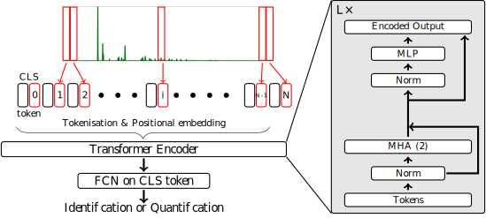

# ViT_for_XRD
## Abstract  
[1] This work was published for the 2025 ICASSP Conference, and following on from our previous work [2].  
We propose to use Vision Transformers (ViT) [3] to identify and quantify mineral phases from X-Ray diffraction patterns.

Jupyter Notebook and databases are available to train the ViT. Our trained models are also available.  
Jupyter Notebook for [Attention Rollout](https://jacobgil.github.io/deeplearning/vision-transformer-explainability) and Positional encoding for identification problem are also available.

## References
[1] **Vision Transformers for X-ray Diffraction Patterns Analysis** Titouan Simonnet, Mame Diarra Fall, Sylvain Grangeon and Bruno Galerne  ICASSP 2025-2025 IEEE International Conference on Acoustics, Speech and Signal Processing (ICASSP). IEEE, 2025. p. 1-5.
[10.1109/ICASSP49660.2025.10887635](10.1109/ICASSP49660.2025.10887635)  
[2] **Phase quantification using deep neural network processing of XRD patterns**, Titouan Simonnet,  Sylvain Grangeon,  Francis Claret,  Nicolas Maubec,  Diarra Fall,  Rachid Harba and  Bruno Galerne, 2023 31st European Signal Processing Conference (EUSIPCO). [10.23919/EUSIPCO58844.2023.10289954](10.23919/EUSIPCO58844.2023.10289954)  
[3] **An image is worth 16x16 words: Transformers for image recognition at scale**, Alexey Dosovitskiy, et al.  arXiv preprint arXiv:2010.11929 (2020) [https://doi.org/10.48550/arXiv.2010.11929](https://doi.org/10.48550/arXiv.2010.11929)  

